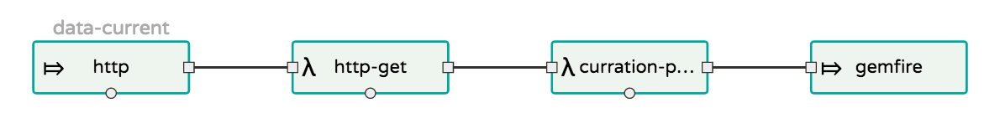

# Demographic Data Manufacturing Demo
  * This demo is a sample of a Data Manufacturing Pipeline that takes in a variety of different data with different formats and different destinations. The key here is to showcase reusible code that will allow for muliple processing features on data in motion. 
  * In order to achieve this, Spring Cloud Stream microservices deployed to Cloud Foundry via Spring Cloud Dataflow was used. 
  * In a Data Manufacturing Pipeline, it is feasable that a variety of data will pass through this process. It is not, however, feasable to assume that all data should go to the same destination. I paradime shift from an A to B load to a Data Microservice is needed. Namely that data purpose, data relevence, and its value to business should dictate its location. A Data Microservice platform, not unlike a standard Microservice platform, maps data to product in a way that will handle it best for the business. This also means that data product is irrelevent in the overall vision of the platform and can be changed will very little itteration. 
  * What follows is an example of such a platform.
     
  * A working demo for viewing is available and deployed via Pivotal Web Services and Amazon Web Services. 
    * The Data Browser UI is available at:
       
       http://ec2-54-218-91-184.us-west-2.compute.amazonaws.com:8080/app.html
      
      * The process in which data is landed follows the current data pipeline.
      
      
      
      * Within this stream, the major player is the curration processor. This allows for data to be enriched on its journy to Gemfire. For the demo a security group, date, source info, and destination info are added. Another use of this filter/transform layer of pipelining is to build a data subset to be cached in GemFire. GemFire should not cache large historical data that would normally be destined for HDFS or GPDB type system.
      
      * It is then served as a Spring Boot app that queries Gemfire for current Demographic data. The data points are aggregated on the google map api and can be zoomed in by clicking in the area you want to browse. This fast access layer showcases the power of GemFire.
  * 
  
## PCF Cli
 * To create a Data Manufacturing Pipeline in Pivotal Cloud Foundry requires the use of the cloud foundry command line tool.
  * This can be downloaded for your platform at https://github.com/cloudfoundry/cli/releases
    * Once downloaded follow the install documentation at https://docs.run.pivotal.io/cf-cli/install-go-cli.html
  * Log in to PCF using the PCF CLI.
 
    ```$ cf login```
  * Run the following command to target the API endpoint, org and space where you want to create the service:
 
    ```$ cf target -a <api-endpoint> -o <organization> -s <space name>```
    
## Deploy Dataflow Server Cloudfoundry
  * This demo requires the latest version of spring-cloud-dataflow-server-cloudfoundry and dataflow-shell
    * To Download execute command:
    
       ```$ git clone https://github.com/spring-cloud/spring-cloud-dataflow-server-cloudfoundry.git```
       
       ```$ wget http://repo.spring.io/release/org/springframework/cloud/spring-cloud-dataflow-shell/1.0.0.RELEASE/spring-cloud-dataflow-shell-1.0.0.RELEASE.jar```
    
    * To deploy to your Cloud Foundry follow the instructions at http://docs.spring.io/spring-cloud-dataflow-server-cloudfoundry/docs/current-SNAPSHOT/reference/htmlsingle/#_deploying_on_cloud_foundry
## Start Demo
